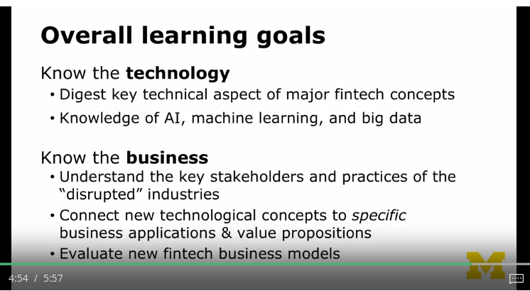

# Learning plan
- Courses will be structured as deep dives into XX money&capital, analysis the technology and the business sides of:
    - transfering
    - raising
    - investing
- Course 1 and Course 2: Innovations in the capital transfer sector
    - 
    - Things in Course 1: the digital and mobile wallet, for instance, PayPal, Venmo, and Apple and Android Pay.
    - Things in Course 2: blockchainn-based payment innovations
- Course 3: Innovations in raising capital and investing money
    - 

# Learning goals
- Overall:
    1. Know the technology
    2. Know the business
    - 
- Goal #2: bridging the gap
    - In fintech, there are many finance talents and there are many tech talents.
    - Sometimes there is a communication barrier between the two sides.
        - The finance people don't understand the technology well enough to make the customer's pitch.
        - The tech people don't understand finance well enough to design the optimal product.

# Fintech
- Fintech - very broadly, is defined as technological innovations that improve how money and capital are transferred, raised and invested.
- Even if the buzzword Fintech is new, technology and finance is not: the financial services industry has always been at the forefront of technological innovation
    - 
- Things what a full-service financial institution (banks?) does on a daily basis:
    - 
- Today, the traditional financial institution is being threatened on all of these fronts, piece by piece, by different types of tech companies:
    - 
